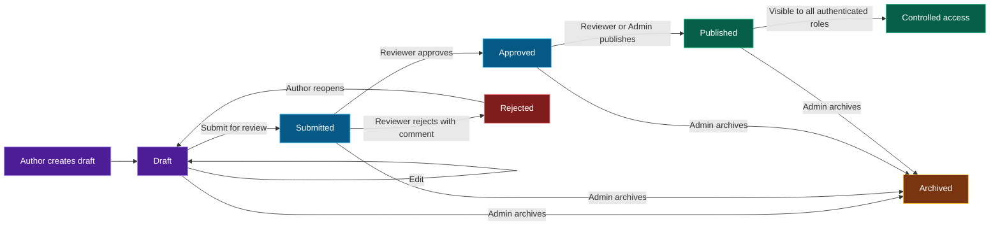

# Controlled Document Approval System

A correctness-first, full-stack workflow application for controlled authoring, review, publication, archival, and append-only audit history. Built using **SvelteKit 5**, **TypeScript**, **PostgreSQL**, and **Drizzle ORM**.

---

## Document Workflow



Every transition is authorization-checked, versioned with optimistic concurrency control, and recorded in the audit timeline.

---

## 1. Prerequisites
Before running the application, make sure you have the following installed:
- [Node.js](https://nodejs.org/) (v20.6.0 or higher is required)
- [Docker Desktop](https://www.docker.com/products/docker-desktop/) (running)

---

## 2. Setup & Installation

### Step 1: Clone & Install Dependencies
```bash
npm install
```

### Step 2: Start PostgreSQL Database Container
Use Docker Compose to launch the database container (configured on port `5433` to prevent conflicts with local services):
```bash
docker compose up -d
```

### Step 3: Run Database Migrations
Deploy the database schema:
```bash
npx drizzle-kit push --force
```

### Step 4: Seed the Database
Populate the database with the required seeded users:
```bash
npx tsx src/lib/server/db/seed.ts
```

---

## 3. Seeded Accounts
You can switch between these profiles at any time using the **Simulate Role dropdown** located in the top navigation bar.

| User Email | Role | Capabilities |
| :--- | :--- | :--- |
| `alice@example.com` | Author | Create draft, edit draft/rejected own docs, submit for review, reopen rejected own docs |
| `bob@example.com` | Reviewer | Approve submitted documents (except own), reject with comment, publish approved |
| `admin@example.com` | Admin | Publish approved documents, archive active documents |
| `viewer@example.com` | Viewer | View published documents only |

---

## 4. Running the Application
To run the full-stack SvelteKit application locally:
```bash
npm run dev
```
Open [http://localhost:5173](http://localhost:5173) in your browser.

---

## 5. Testing
The project includes a comprehensive test suite covering integration and E2E requirements:

### Run Backend Integration Tests (Vitest)
Verifies database integrity, role authorization, state transition guards, and optimistic concurrency rules:
```bash
npm run test:unit -- --run
```

### Run End-to-End Tests (Playwright)
Executes the happy path E2E flow (Author creates -> edits -> submits -> Reviewer approves -> Admin publishes -> Viewer accesses -> Audit timeline check):
```bash
npm run test:e2e:install # first run only
npm run test:e2e
```

> Use a dedicated test database when running the integration or E2E suites. They create workflow records as part of validation and should not point at production data.
